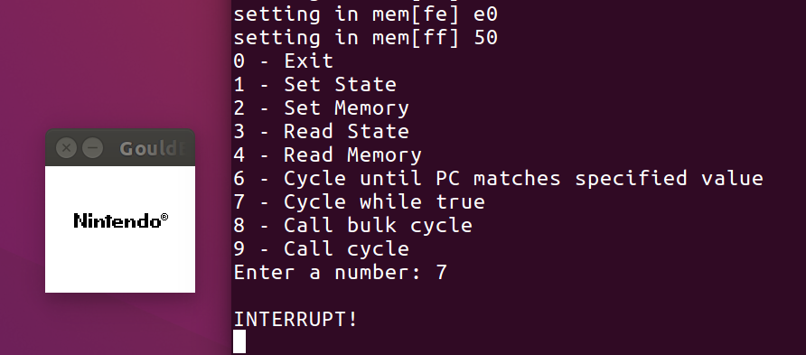
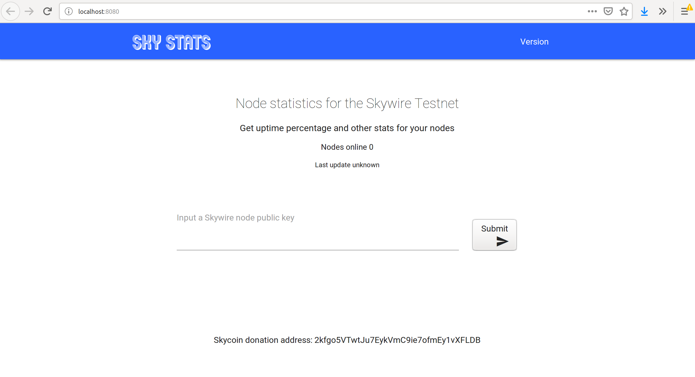

## My Projects
This a speed round of the different projects I've worked on for fun.

### Gouldboy Color - a GameBoy Color emulator written in C
{: .center-image} <!-- width="336" height="200" alt="Gouldboy Color"> -->
A gameboy emulator written by scratch in C. This was pitched as an alternative, independent project for my Advanced Computer Architecture course.

It more/less fully implements a Zilog Z80 Hybrid CPU over ~1200 lines of code. Though nominally an 8-bit CPU, there are 2 16bit registers, one of which is the Stack      Pointer (SP) which allows for much more available memory (2^16 bits).

[Link to project](https://github.com/maxsvetlik/gouldboycolor)

### SkyStatistics a full-stack webserver written in Go
{: .center-image} <!-- width="336" height="200" alt="Skywire Uptime Server" -->
A server written in Go that crawled the Skycoin / Skywire crytocurrency network and collected statistics on nodes connected to the network.

The server would scrape the network periodically to build and maintain a database of connected nodes on the network. This allowed for statistics to be generated for a give node or node cluster.
Why did I choose to make this? I participated in a network test of which I could receive rewards in my nodes had 75% uptime or more. However, there were no tools available for participants to check the uptime of their nodes. This was my solution to that.

Months later, the Skywire Team released their similar tool. I have since stopped hosting / running the tool.

### Graphitime
This was another full-stack webserver written in Go. This tool allowed for users to create an account using Google credentials and upload photos of Graphiti.

The tool logs the geolocation information of the photos and the images themselves, and creates a timeline of graphiti over time. Since graphiti can be covered up, this allows someone to pick a location and browse back in time to see the different tags.

