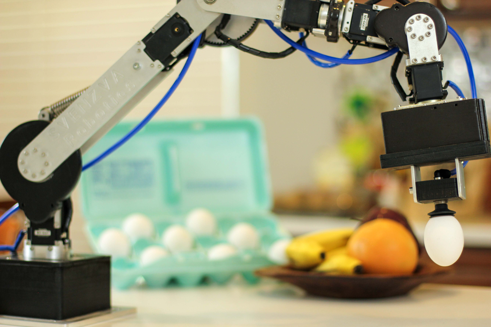
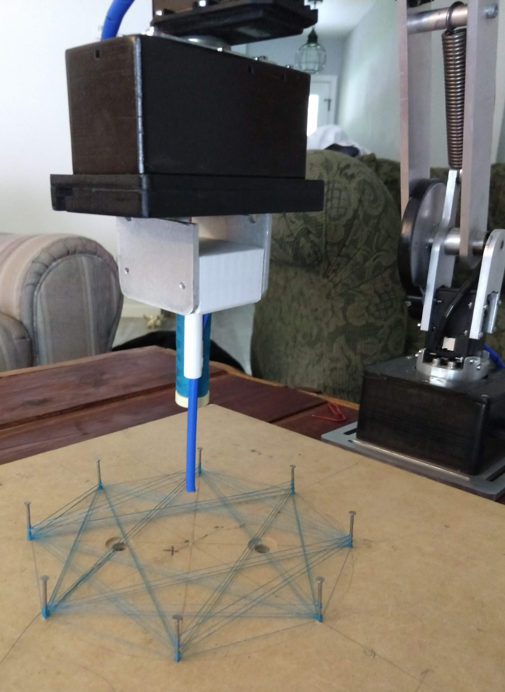
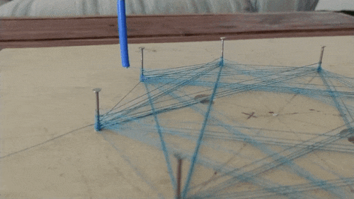

## Professional Highlights
This a speed round of the different projects I've worked on professionally.

Some projects have been fleshed out into a blog post digging into more detail.

## [SVENZVA ROBOTICS](https://svenzva.com)
*I serve as Co-Founder and Head of Software*

Below are just a few examples of my work at Svenzva

### Development of a Low Cost Robotic Arm
{:height="75%" width="75%" .center-image}

The development of a low-cost, highly capable robotic arm was the primary focus for Svenzva Robotics. The robot was built around so-called smart actuators (Dynamixels) and designed to be able to hold 1.2kg at its full reach position of 63cm and to have 6 degrees of freedom.

With these physical features, along with the capabilities of the servos (data output, integrated control, position/velocity/torque operating modes) the robot is well poised for research and education. The robot remains affordable, however, compared to other robots of similar design.

### Automated String Art
{:height="50%" width="50%"}

{:height="50%" width="50%"}

String Art is 60's-era craze that used pegs and string to make 2.5D patterns. There are low-dimension robots that are very good at making string art, but I was  interested if a general purpose 6DOF robot could.

It turns out the answer is yes. The Revel robot uses a gcode-interpreter (written by yours truly) so the art is commanded by a gcode (numerical control) file.

You can find the project [here](https://github.com/SvenzvaRobotics/raapps/tree/master/gcode_processor/src)

### Hot-Swap Gripper
Part of the appeal of the Revel Robotic Arm is that it is more customizable than traditional robot arms. 
A great example of that is add-on Gripper attachment that makes adding new gripper functionality simple and inexpensive.

Through precisely manufactured rack-and-pinion fingers, I designed and fabricated the attachments for 
- a pressure insensative drawing device that accepts a variety of utensils 
- a vacuum suction gripper ([link](https://a360.co/2VawAUk))
- a flexible thread-and-rod assembly for the making of string art

## [SOCIALLY INTELLIGENT MACHINES LAB - 2017](http://sim.ece.utexas.edu/research.html)

### Multi-level Robot Autonomous Navigation and Planning
  
### Integration of a Socially Aware Robot
My primary responsibilities at SIM Lab was the software integration of commercial off the shelf hardware for a new, socially aware robot design. This includes writing ROS wrappers for components with existing drivers, and writing drivers from scratch for those that did not.

The design of the robot's outward facing appearance was carefully iteraterated, as the robot would be used specifically for human robot interaction research.

You can see the robot (without its protective breastplate) in the video below.
{: .center-image}

While designing the software stack of a new robot was fun in general, my favorite part of the project was designing the drivers for the LED backlit eyes.
Its with these eyes that the robot can help communicate intent or interest in something in the environment. You can see this in the image below.

{: .center-image}

You can find the open source software repository [here](https://github.com/si-machines/poli2). Overall the project was around 300,000 lines of code.
